# DevOps Project 10 — Kubernetes Platform Engineering on AWS

## Overview
This project demonstrates a cloud-native Platform Engineering environment built on AWS using Terraform, Amazon EKS, GitHub Actions, ArgoCD, Prometheus, Grafana, and Istio.
The platform follows GitOps principles, supports multi-environment deployments, provides observability through monitoring dashboards, and implements service mesh capabilities for advanced traffic management.

---

## Architecture Diagram

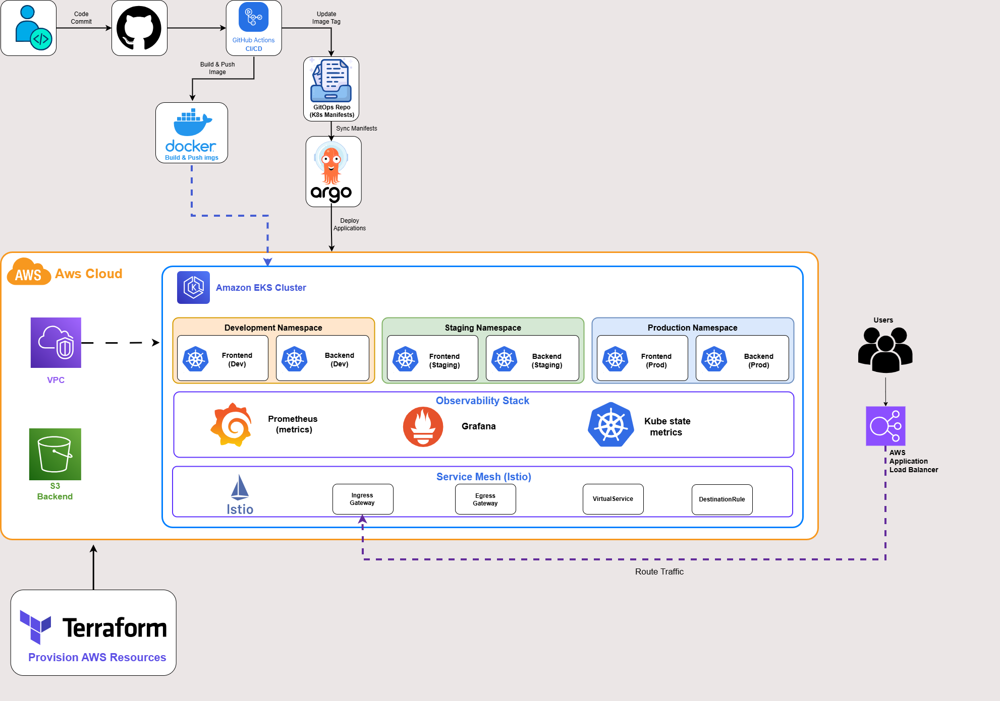

---

## Key Features

* Infrastructure as Code using Terraform
* Amazon EKS cluster provisioning
* GitOps deployment workflow using ArgoCD
* Multi-environment architecture (Development / Staging / Production)
* CI/CD automation using GitHub Actions
* Monitoring with Prometheus
* Visualization and dashboards with Grafana
* Service Mesh implementation using Istio
* Canary deployment strategy using Istio VirtualService and DestinationRule

---

## Technology Stack

* AWS EKS
* Terraform
* Kubernetes
* Docker
* GitHub Actions
* ArgoCD
* Helm
* Prometheus
* Grafana
* Istio

---

## Architecture Components

### Infrastructure Layer

Terraform provisions:

* VPC
* Subnets
* Route Tables
* IAM Roles
* Amazon EKS Cluster
* Managed Node Groups

### GitOps Layer

ArgoCD continuously synchronizes Kubernetes resources from the GitOps repository and ensures the cluster state matches the desired state stored in Git.

### Observability Layer

Prometheus collects cluster metrics while Grafana provides dashboard visualization for monitoring workloads, nodes, and cluster health.

### Service Mesh Layer

Istio provides advanced traffic management capabilities using:

* VirtualService
* DestinationRule

Traffic can be routed between application versions to support progressive delivery and canary deployments.

---

## Deployment Flow

Developer

↓

GitHub Repository

↓

GitHub Actions

↓

Docker Hub

↓

GitOps Repository

↓

ArgoCD

↓

Amazon EKS

↓

Kubernetes Workloads

---

## Canary Deployment Strategy

The platform implements canary deployment capabilities using Istio traffic management resources.

Two application versions were deployed simultaneously:

* frontend-v1
* frontend-v2

Traffic routing was controlled through:

* VirtualService
* DestinationRule

Traffic distribution scenarios tested during validation:

* 100 / 0 rollout
* 90 / 10 canary deployment
* 50 / 50 traffic distribution

The final configuration was restored to a 90 / 10 traffic split before environment teardown.

This approach demonstrates progressive delivery techniques commonly used in production Kubernetes environments, allowing new application versions to receive a controlled percentage of live traffic before full rollout.

---

# Screenshots

## Terraform Infrastructure

### Terraform Apply
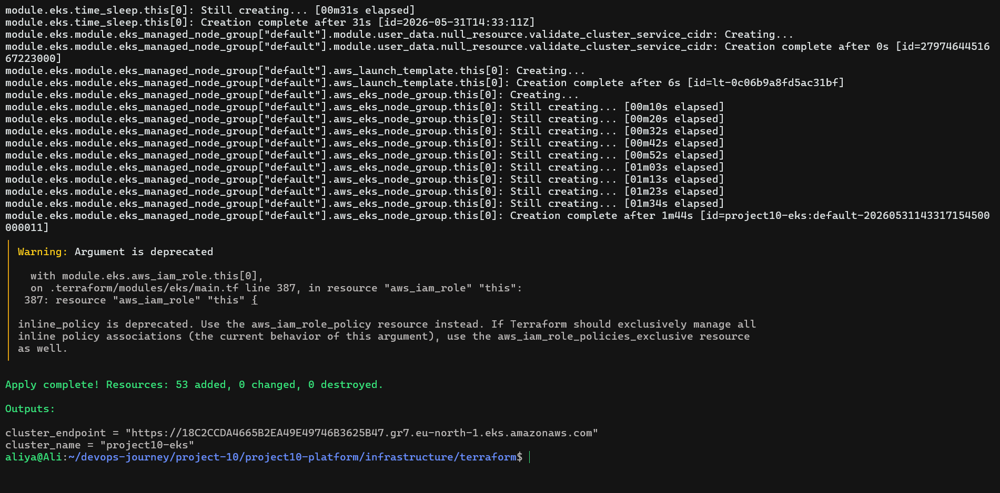

### EKS Worker Nodes
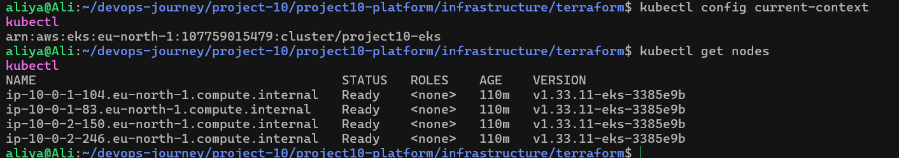

---

## GitOps & ArgoCD

### ArgoCD Applications
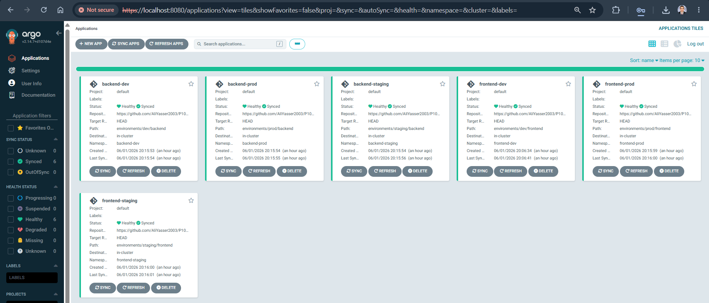

### ArgoCD Frontend-Staging
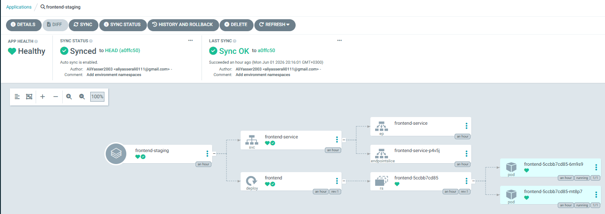

### ArgoCD Backend-Pro
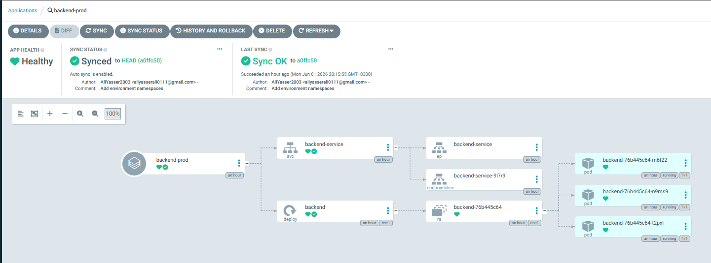

### Git-Actions_CICD
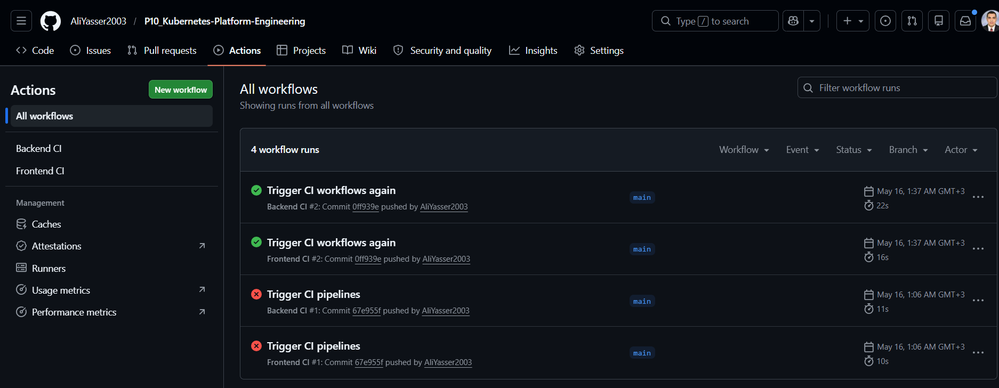

---

## Multi-Environment Deployment

### Namespaces
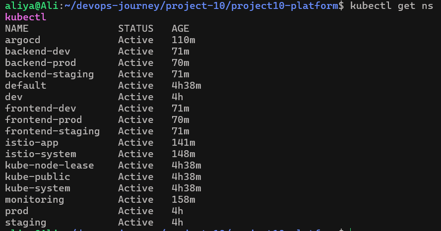


---

## Monitoring

### Monitoring Stack
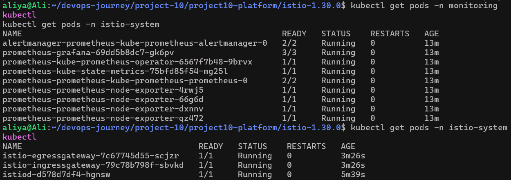

### Grafana Namespace Dashboard
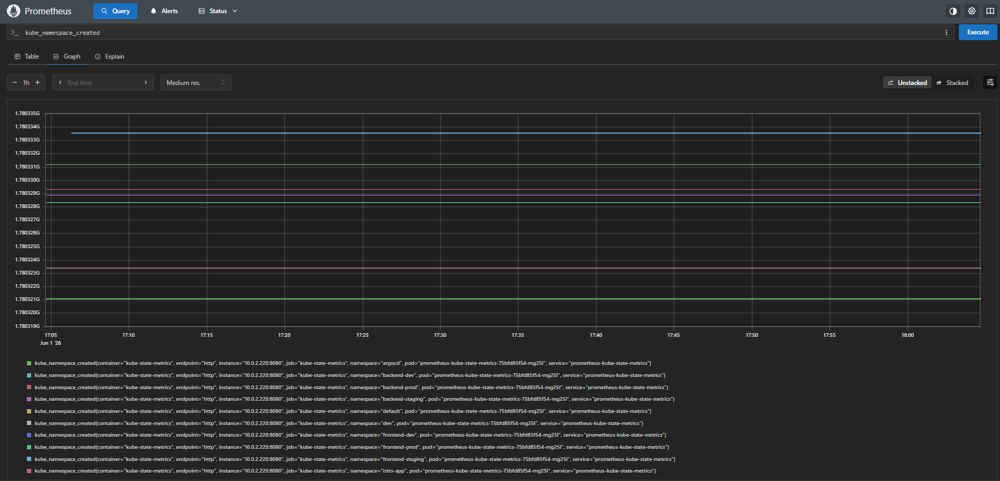

### Prometheus Dashboard
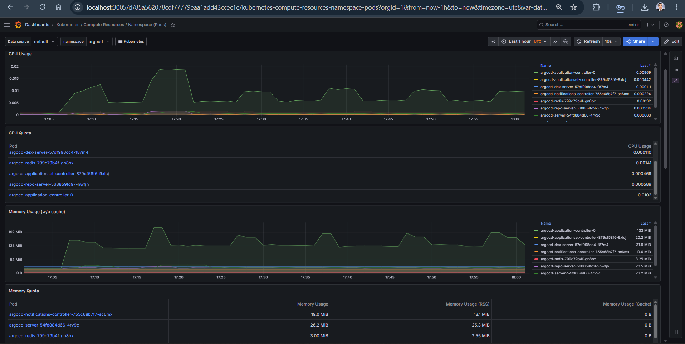

---

## Istio Service Mesh

### Istio Components
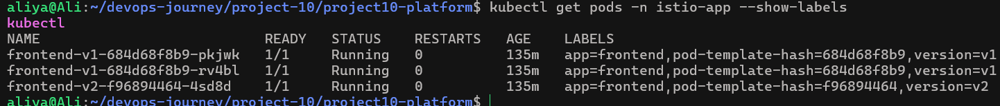

### Traffic-Split, VirtualService and DestinationRule
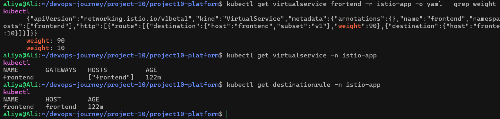

---

## Troubleshooting

### EKS Endpoint Mismatch

**Issue**

kubectl was pointing to an outdated EKS endpoint after cluster recreation.

**Solution**

```bash
aws eks update-kubeconfig --region eu-north-1 --name project10-eks
```

### ArgoCD Image Pull Failures

**Issue**

ArgoCD pods entered ImagePullBackOff state.

**Cause**

Temporary connectivity issues reaching the container registry.

**Solution**

Recreated workloads after registry connectivity was restored.

### Istio Sidecar Injection Timeout

**Issue**

Pods failed to create due to admission webhook timeout.

**Error**

```text
failed calling webhook "namespace.sidecar-injector.istio.io"
```

**Solution**

Validated Istio control plane health and redeployed workloads.

### Grafana Access

**Issue**

Grafana UI required local access.

**Solution**

```bash
kubectl port-forward svc/prometheus-grafana 3000:80 -n monitoring
```

---

## Lessons Learned

Through this project I gained hands-on experience with:

* Platform Engineering concepts
* Kubernetes multi-environment deployments
* GitOps workflows using ArgoCD
* Infrastructure as Code with Terraform
* Observability using Prometheus and Grafana
* Service Mesh architecture using Istio
* Canary deployment strategies
* Progressive delivery techniques
* Production-style Kubernetes operations

---

## Conclusion

This project demonstrates a complete Platform Engineering workflow on AWS using modern cloud-native technologies. It combines Infrastructure as Code, GitOps, observability, and service mesh capabilities into a production-inspired Kubernetes platform.
